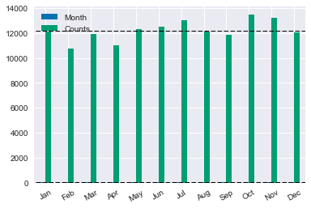

```python
import pandas as pd
import numpy as np
import matplotlib.pyplot as plt
import seaborn as sns
%matplotlib inline
plt.style.use('seaborn-colorblind')
```

### Accidents Dataframe


```python
accidents = ('./DfTRoadSafety_Accidents_2014.csv')
accidents_df = pd.read_csv(accidents)
accidents_df.head()
```


<div>
<table border="1" class="dataframe">
  <thead>
    <tr style="text-align: right;">
      <th></th>
      <th>Accident_Index</th>
      <th>Location_Easting_OSGR</th>
      <th>Location_Northing_OSGR</th>
      <th>Longitude</th>
      <th>Latitude</th>
      <th>Police_Force</th>
      <th>Accident_Severity</th>
      <th>Number_of_Vehicles</th>
      <th>Number_of_Casualties</th>
      <th>Date</th>
      <th>...</th>
      <th>Pedestrian_Crossing-Human_Control</th>
      <th>Pedestrian_Crossing-Physical_Facilities</th>
      <th>Light_Conditions</th>
      <th>Weather_Conditions</th>
      <th>Road_Surface_Conditions</th>
      <th>Special_Conditions_at_Site</th>
      <th>Carriageway_Hazards</th>
      <th>Urban_or_Rural_Area</th>
      <th>Did_Police_Officer_Attend_Scene_of_Accident</th>
      <th>LSOA_of_Accident_Location</th>
    </tr>
  </thead>
  <tbody>
    <tr>
      <th>0</th>
      <td>201401BS70001</td>
      <td>524600</td>
      <td>179020</td>
      <td>-0.206443</td>
      <td>51.496345</td>
      <td>1</td>
      <td>3</td>
      <td>2</td>
      <td>1</td>
      <td>09/01/2014</td>
      <td>...</td>
      <td>0</td>
      <td>0</td>
      <td>1</td>
      <td>2</td>
      <td>2</td>
      <td>0</td>
      <td>0</td>
      <td>1</td>
      <td>2</td>
      <td>E01002814</td>
    </tr>
    <tr>
      <th>1</th>
      <td>201401BS70002</td>
      <td>525780</td>
      <td>178290</td>
      <td>-0.189713</td>
      <td>51.489523</td>
      <td>1</td>
      <td>3</td>
      <td>2</td>
      <td>1</td>
      <td>20/01/2014</td>
      <td>...</td>
      <td>0</td>
      <td>5</td>
      <td>7</td>
      <td>1</td>
      <td>1</td>
      <td>0</td>
      <td>0</td>
      <td>1</td>
      <td>2</td>
      <td>E01002894</td>
    </tr>
    <tr>
      <th>2</th>
      <td>201401BS70003</td>
      <td>526880</td>
      <td>178430</td>
      <td>-0.173827</td>
      <td>51.490536</td>
      <td>1</td>
      <td>3</td>
      <td>2</td>
      <td>1</td>
      <td>21/01/2014</td>
      <td>...</td>
      <td>0</td>
      <td>0</td>
      <td>1</td>
      <td>1</td>
      <td>1</td>
      <td>0</td>
      <td>0</td>
      <td>1</td>
      <td>1</td>
      <td>E01002822</td>
    </tr>
    <tr>
      <th>3</th>
      <td>201401BS70004</td>
      <td>525580</td>
      <td>179080</td>
      <td>-0.192311</td>
      <td>51.496668</td>
      <td>1</td>
      <td>3</td>
      <td>1</td>
      <td>1</td>
      <td>15/01/2014</td>
      <td>...</td>
      <td>0</td>
      <td>1</td>
      <td>4</td>
      <td>1</td>
      <td>1</td>
      <td>0</td>
      <td>0</td>
      <td>1</td>
      <td>2</td>
      <td>E01002812</td>
    </tr>
    <tr>
      <th>4</th>
      <td>201401BS70006</td>
      <td>527040</td>
      <td>179030</td>
      <td>-0.171308</td>
      <td>51.495892</td>
      <td>1</td>
      <td>3</td>
      <td>2</td>
      <td>1</td>
      <td>09/01/2014</td>
      <td>...</td>
      <td>0</td>
      <td>8</td>
      <td>1</td>
      <td>1</td>
      <td>1</td>
      <td>0</td>
      <td>0</td>
      <td>1</td>
      <td>1</td>
      <td>E01002821</td>
    </tr>
  </tbody>
</table>
<p>5 rows × 32 columns</p>
</div>


### Some Data Exploration


```python
accidents_df.shape
```


    (146322, 32)


```python
# to view the columns and the corresponding data types in each column, use the enumerate function:
for index, (name, dtype) in enumerate(zip(accidents_df.columns, accidents_df.dtypes)):
    print('{}.{}({})'.format(index, name, dtype))
```

    0.Accident_Index(object)
    1.Location_Easting_OSGR(int64)
    2.Location_Northing_OSGR(int64)
    3.Longitude(float64)
    4.Latitude(float64)
    5.Police_Force(int64)
    6.Accident_Severity(int64)
    7.Number_of_Vehicles(int64)
    8.Number_of_Casualties(int64)
    9.Date(object)
    10.Day_of_Week(int64)
    11.Time(object)
    12.Local_Authority_(District)(int64)
    13.Local_Authority_(Highway)(object)
    14.1st_Road_Class(int64)
    15.1st_Road_Number(int64)
    16.Road_Type(int64)
    17.Speed_limit(int64)
    18.Junction_Detail(int64)
    19.Junction_Control(int64)
    20.2nd_Road_Class(int64)
    21.2nd_Road_Number(int64)
    22.Pedestrian_Crossing-Human_Control(int64)
    23.Pedestrian_Crossing-Physical_Facilities(int64)
    24.Light_Conditions(int64)
    25.Weather_Conditions(int64)
    26.Road_Surface_Conditions(int64)
    27.Special_Conditions_at_Site(int64)
    28.Carriageway_Hazards(int64)
    29.Urban_or_Rural_Area(int64)
    30.Did_Police_Officer_Attend_Scene_of_Accident(int64)
    31.LSOA_of_Accident_Location(object)


```python
#would like to split the date string to get the number in the middle (month)
#get the date string
date_string = '09/01/2014'
```


```python
#split the date string
split_date = date_string.split('/')
split_date
```


    ['09', '01', '2014']


```python
#grab the second element which represents the month
#convert the string (05) into number using 'int'
month = int(split_date[1])
month
```


    1


```python
#now create a function to do this job, then pass the function to Pandas 'apply'
def get_month_from_date_string (date_string):
    split_date = date_string.split('/')
    month_string = int(split_date[1])
    month_number = int(month_string)
    return month_number

```


```python
#let's just give it a try
get_month_from_date_string('09/02/2014')
```


    2


```python
# now create a column in the merged datafram for the 'month'
#month_number = accidents_casualties_vehicles['Date'].apply(get_month_from_date_string)
month_number = accidents_df['Date'].apply(get_month_from_date_string)
month_number.head()
```


    0    1
    1    1
    2    1
    3    1
    4    1
    Name: Date, dtype: int64


```python
accidents_df['Month'] = month_number
```


```python
accidents_df.shape
```


    (146322, 33)


```python
accidents_df.columns
```


    Index(['Accident_Index', 'Location_Easting_OSGR', 'Location_Northing_OSGR',
           'Longitude', 'Latitude', 'Police_Force', 'Accident_Severity',
           'Number_of_Vehicles', 'Number_of_Casualties', 'Date', 'Day_of_Week',
           'Time', 'Local_Authority_(District)', 'Local_Authority_(Highway)',
           '1st_Road_Class', '1st_Road_Number', 'Road_Type', 'Speed_limit',
           'Junction_Detail', 'Junction_Control', '2nd_Road_Class',
           '2nd_Road_Number', 'Pedestrian_Crossing-Human_Control',
           'Pedestrian_Crossing-Physical_Facilities', 'Light_Conditions',
           'Weather_Conditions', 'Road_Surface_Conditions',
           'Special_Conditions_at_Site', 'Carriageway_Hazards',
           'Urban_or_Rural_Area', 'Did_Police_Officer_Attend_Scene_of_Accident',
           'LSOA_of_Accident_Location', 'Month'],
          dtype='object')


### Casualties Data


```python
casualties = ('./DfTRoadSafety_Casualties_2014.csv')
casualties_df = pd.read_csv(casualties)
casualties_df.head()
```


<div>
<table border="1" class="dataframe">
  <thead>
    <tr style="text-align: right;">
      <th></th>
      <th>Accident_Index</th>
      <th>Vehicle_Reference</th>
      <th>Casualty_Reference</th>
      <th>Casualty_Class</th>
      <th>Sex_of_Casualty</th>
      <th>Age_of_Casualty</th>
      <th>Age_Band_of_Casualty</th>
      <th>Casualty_Severity</th>
      <th>Pedestrian_Location</th>
      <th>Pedestrian_Movement</th>
      <th>Car_Passenger</th>
      <th>Bus_or_Coach_Passenger</th>
      <th>Pedestrian_Road_Maintenance_Worker</th>
      <th>Casualty_Type</th>
      <th>Casualty_Home_Area_Type</th>
    </tr>
  </thead>
  <tbody>
    <tr>
      <th>0</th>
      <td>201401BS70001</td>
      <td>1</td>
      <td>1</td>
      <td>1</td>
      <td>1</td>
      <td>49</td>
      <td>8</td>
      <td>3</td>
      <td>0</td>
      <td>0</td>
      <td>0</td>
      <td>0</td>
      <td>0</td>
      <td>8</td>
      <td>1</td>
    </tr>
    <tr>
      <th>1</th>
      <td>201401BS70002</td>
      <td>2</td>
      <td>1</td>
      <td>1</td>
      <td>2</td>
      <td>27</td>
      <td>6</td>
      <td>3</td>
      <td>0</td>
      <td>0</td>
      <td>0</td>
      <td>0</td>
      <td>0</td>
      <td>1</td>
      <td>-1</td>
    </tr>
    <tr>
      <th>2</th>
      <td>201401BS70003</td>
      <td>2</td>
      <td>1</td>
      <td>1</td>
      <td>1</td>
      <td>27</td>
      <td>6</td>
      <td>3</td>
      <td>0</td>
      <td>0</td>
      <td>0</td>
      <td>0</td>
      <td>0</td>
      <td>3</td>
      <td>1</td>
    </tr>
    <tr>
      <th>3</th>
      <td>201401BS70004</td>
      <td>1</td>
      <td>1</td>
      <td>3</td>
      <td>2</td>
      <td>31</td>
      <td>6</td>
      <td>3</td>
      <td>1</td>
      <td>1</td>
      <td>0</td>
      <td>0</td>
      <td>2</td>
      <td>0</td>
      <td>1</td>
    </tr>
    <tr>
      <th>4</th>
      <td>201401BS70006</td>
      <td>1</td>
      <td>1</td>
      <td>1</td>
      <td>1</td>
      <td>32</td>
      <td>6</td>
      <td>3</td>
      <td>0</td>
      <td>0</td>
      <td>0</td>
      <td>0</td>
      <td>0</td>
      <td>9</td>
      <td>1</td>
    </tr>
  </tbody>
</table>
</div>


```python
casualties_df.shape
```


    (194477, 15)


```python
# view the columns and data types using the enumerate function
for index, (name,dtype) in enumerate(zip(casualties_df.columns, casualties_df.dtypes)):
    print('{}.{}({})'.format(index,name,dtype))
```

    0.Accident_Index(object)
    1.Vehicle_Reference(int64)
    2.Casualty_Reference(int64)
    3.Casualty_Class(int64)
    4.Sex_of_Casualty(int64)
    5.Age_of_Casualty(int64)
    6.Age_Band_of_Casualty(int64)
    7.Casualty_Severity(int64)
    8.Pedestrian_Location(int64)
    9.Pedestrian_Movement(int64)
    10.Car_Passenger(int64)
    11.Bus_or_Coach_Passenger(int64)
    12.Pedestrian_Road_Maintenance_Worker(int64)
    13.Casualty_Type(int64)
    14.Casualty_Home_Area_Type(int64)


### Vehicles Data


```python
vehicles = ('./DfTRoadSafety_Vehicles_2014.csv')
vehicles_df = pd.read_csv(vehicles)
vehicles_df.head()
```


<div>
<table border="1" class="dataframe">
  <thead>
    <tr style="text-align: right;">
      <th></th>
      <th>Accident_Index</th>
      <th>Vehicle_Reference</th>
      <th>Vehicle_Type</th>
      <th>Towing_and_Articulation</th>
      <th>Vehicle_Manoeuvre</th>
      <th>Vehicle_Location-Restricted_Lane</th>
      <th>Junction_Location</th>
      <th>Skidding_and_Overturning</th>
      <th>Hit_Object_in_Carriageway</th>
      <th>Vehicle_Leaving_Carriageway</th>
      <th>...</th>
      <th>Was_Vehicle_Left_Hand_Drive?</th>
      <th>Journey_Purpose_of_Driver</th>
      <th>Sex_of_Driver</th>
      <th>Age_of_Driver</th>
      <th>Age_Band_of_Driver</th>
      <th>Engine_Capacity_(CC)</th>
      <th>Propulsion_Code</th>
      <th>Age_of_Vehicle</th>
      <th>Driver_IMD_Decile</th>
      <th>Driver_Home_Area_Type</th>
    </tr>
  </thead>
  <tbody>
    <tr>
      <th>0</th>
      <td>201401BS70001</td>
      <td>1</td>
      <td>8</td>
      <td>0</td>
      <td>18</td>
      <td>0</td>
      <td>0</td>
      <td>0</td>
      <td>0</td>
      <td>0</td>
      <td>...</td>
      <td>1</td>
      <td>1</td>
      <td>1</td>
      <td>49</td>
      <td>8</td>
      <td>1997</td>
      <td>2</td>
      <td>2</td>
      <td>4</td>
      <td>1</td>
    </tr>
    <tr>
      <th>1</th>
      <td>201401BS70001</td>
      <td>2</td>
      <td>19</td>
      <td>0</td>
      <td>15</td>
      <td>0</td>
      <td>0</td>
      <td>0</td>
      <td>0</td>
      <td>0</td>
      <td>...</td>
      <td>1</td>
      <td>6</td>
      <td>1</td>
      <td>-1</td>
      <td>-1</td>
      <td>4249</td>
      <td>2</td>
      <td>2</td>
      <td>-1</td>
      <td>-1</td>
    </tr>
    <tr>
      <th>2</th>
      <td>201401BS70002</td>
      <td>1</td>
      <td>9</td>
      <td>0</td>
      <td>2</td>
      <td>0</td>
      <td>1</td>
      <td>0</td>
      <td>0</td>
      <td>0</td>
      <td>...</td>
      <td>1</td>
      <td>6</td>
      <td>1</td>
      <td>-1</td>
      <td>-1</td>
      <td>6750</td>
      <td>1</td>
      <td>12</td>
      <td>-1</td>
      <td>-1</td>
    </tr>
    <tr>
      <th>3</th>
      <td>201401BS70002</td>
      <td>2</td>
      <td>1</td>
      <td>0</td>
      <td>14</td>
      <td>0</td>
      <td>1</td>
      <td>0</td>
      <td>4</td>
      <td>0</td>
      <td>...</td>
      <td>1</td>
      <td>6</td>
      <td>2</td>
      <td>27</td>
      <td>6</td>
      <td>-1</td>
      <td>-1</td>
      <td>-1</td>
      <td>-1</td>
      <td>-1</td>
    </tr>
    <tr>
      <th>4</th>
      <td>201401BS70003</td>
      <td>1</td>
      <td>9</td>
      <td>0</td>
      <td>9</td>
      <td>0</td>
      <td>5</td>
      <td>0</td>
      <td>0</td>
      <td>0</td>
      <td>...</td>
      <td>1</td>
      <td>6</td>
      <td>1</td>
      <td>49</td>
      <td>8</td>
      <td>1598</td>
      <td>1</td>
      <td>4</td>
      <td>1</td>
      <td>1</td>
    </tr>
  </tbody>
</table>
<p>5 rows × 22 columns</p>
</div>


```python
vehicles_df.shape
```


    (268527, 22)


```python
# view the columns and data types using the enumerate function
for index, (name, dtype) in enumerate(zip(vehicles_df.columns, vehicles_df.dtypes)):
    print('{}.{}({})'.format(index,name,dtype))
```

    0.Accident_Index(object)
    1.Vehicle_Reference(int64)
    2.Vehicle_Type(int64)
    3.Towing_and_Articulation(int64)
    4.Vehicle_Manoeuvre(int64)
    5.Vehicle_Location-Restricted_Lane(int64)
    6.Junction_Location(int64)
    7.Skidding_and_Overturning(int64)
    8.Hit_Object_in_Carriageway(int64)
    9.Vehicle_Leaving_Carriageway(int64)
    10.Hit_Object_off_Carriageway(int64)
    11.1st_Point_of_Impact(int64)
    12.Was_Vehicle_Left_Hand_Drive?(int64)
    13.Journey_Purpose_of_Driver(int64)
    14.Sex_of_Driver(int64)
    15.Age_of_Driver(int64)
    16.Age_Band_of_Driver(int64)
    17.Engine_Capacity_(CC)(int64)
    18.Propulsion_Code(int64)
    19.Age_of_Vehicle(int64)
    20.Driver_IMD_Decile(int64)
    21.Driver_Home_Area_Type(int64)


### Merging the tables


```python
# merge the first two tables: accidents_df and casualties_df
accidents_casualties_merge = pd.merge(accidents_df, casualties_df, on = 'Accident_Index')

```


```python
# merge the first two tables with the vehicles_df table
accidents_casualties_vehicles = pd.merge(accidents_casualties_merge, vehicles_df, on = 'Accident_Index')
accidents_casualties_vehicles.head()
```


<div>
<table border="1" class="dataframe">
  <thead>
    <tr style="text-align: right;">
      <th></th>
      <th>Accident_Index</th>
      <th>Location_Easting_OSGR</th>
      <th>Location_Northing_OSGR</th>
      <th>Longitude</th>
      <th>Latitude</th>
      <th>Police_Force</th>
      <th>Accident_Severity</th>
      <th>Number_of_Vehicles</th>
      <th>Number_of_Casualties</th>
      <th>Date</th>
      <th>...</th>
      <th>Was_Vehicle_Left_Hand_Drive?</th>
      <th>Journey_Purpose_of_Driver</th>
      <th>Sex_of_Driver</th>
      <th>Age_of_Driver</th>
      <th>Age_Band_of_Driver</th>
      <th>Engine_Capacity_(CC)</th>
      <th>Propulsion_Code</th>
      <th>Age_of_Vehicle</th>
      <th>Driver_IMD_Decile</th>
      <th>Driver_Home_Area_Type</th>
    </tr>
  </thead>
  <tbody>
    <tr>
      <th>0</th>
      <td>201401BS70001</td>
      <td>524600</td>
      <td>179020</td>
      <td>-0.206443</td>
      <td>51.496345</td>
      <td>1</td>
      <td>3</td>
      <td>2</td>
      <td>1</td>
      <td>09/01/2014</td>
      <td>...</td>
      <td>1</td>
      <td>1</td>
      <td>1</td>
      <td>49</td>
      <td>8</td>
      <td>1997</td>
      <td>2</td>
      <td>2</td>
      <td>4</td>
      <td>1</td>
    </tr>
    <tr>
      <th>1</th>
      <td>201401BS70001</td>
      <td>524600</td>
      <td>179020</td>
      <td>-0.206443</td>
      <td>51.496345</td>
      <td>1</td>
      <td>3</td>
      <td>2</td>
      <td>1</td>
      <td>09/01/2014</td>
      <td>...</td>
      <td>1</td>
      <td>6</td>
      <td>1</td>
      <td>-1</td>
      <td>-1</td>
      <td>4249</td>
      <td>2</td>
      <td>2</td>
      <td>-1</td>
      <td>-1</td>
    </tr>
    <tr>
      <th>2</th>
      <td>201401BS70002</td>
      <td>525780</td>
      <td>178290</td>
      <td>-0.189713</td>
      <td>51.489523</td>
      <td>1</td>
      <td>3</td>
      <td>2</td>
      <td>1</td>
      <td>20/01/2014</td>
      <td>...</td>
      <td>1</td>
      <td>6</td>
      <td>1</td>
      <td>-1</td>
      <td>-1</td>
      <td>6750</td>
      <td>1</td>
      <td>12</td>
      <td>-1</td>
      <td>-1</td>
    </tr>
    <tr>
      <th>3</th>
      <td>201401BS70002</td>
      <td>525780</td>
      <td>178290</td>
      <td>-0.189713</td>
      <td>51.489523</td>
      <td>1</td>
      <td>3</td>
      <td>2</td>
      <td>1</td>
      <td>20/01/2014</td>
      <td>...</td>
      <td>1</td>
      <td>6</td>
      <td>2</td>
      <td>27</td>
      <td>6</td>
      <td>-1</td>
      <td>-1</td>
      <td>-1</td>
      <td>-1</td>
      <td>-1</td>
    </tr>
    <tr>
      <th>4</th>
      <td>201401BS70003</td>
      <td>526880</td>
      <td>178430</td>
      <td>-0.173827</td>
      <td>51.490536</td>
      <td>1</td>
      <td>3</td>
      <td>2</td>
      <td>1</td>
      <td>21/01/2014</td>
      <td>...</td>
      <td>1</td>
      <td>6</td>
      <td>1</td>
      <td>49</td>
      <td>8</td>
      <td>1598</td>
      <td>1</td>
      <td>4</td>
      <td>1</td>
      <td>1</td>
    </tr>
  </tbody>
</table>
<p>5 rows × 68 columns</p>
</div>


```python
accidents_casualties_vehicles.shape
```


    (377091, 68)


### Check if the data are on different scales?

### Might need to rescale


```python
#check if the month column is included in the dataset
accidents_casualties_vehicles.columns
```


    Index(['Accident_Index', 'Location_Easting_OSGR', 'Location_Northing_OSGR',
           'Longitude', 'Latitude', 'Police_Force', 'Accident_Severity',
           'Number_of_Vehicles', 'Number_of_Casualties', 'Date', 'Day_of_Week',
           'Time', 'Local_Authority_(District)', 'Local_Authority_(Highway)',
           '1st_Road_Class', '1st_Road_Number', 'Road_Type', 'Speed_limit',
           'Junction_Detail', 'Junction_Control', '2nd_Road_Class',
           '2nd_Road_Number', 'Pedestrian_Crossing-Human_Control',
           'Pedestrian_Crossing-Physical_Facilities', 'Light_Conditions',
           'Weather_Conditions', 'Road_Surface_Conditions',
           'Special_Conditions_at_Site', 'Carriageway_Hazards',
           'Urban_or_Rural_Area', 'Did_Police_Officer_Attend_Scene_of_Accident',
           'LSOA_of_Accident_Location', 'Month', 'Vehicle_Reference_x',
           'Casualty_Reference', 'Casualty_Class', 'Sex_of_Casualty',
           'Age_of_Casualty', 'Age_Band_of_Casualty', 'Casualty_Severity',
           'Pedestrian_Location', 'Pedestrian_Movement', 'Car_Passenger',
           'Bus_or_Coach_Passenger', 'Pedestrian_Road_Maintenance_Worker',
           'Casualty_Type', 'Casualty_Home_Area_Type', 'Vehicle_Reference_y',
           'Vehicle_Type', 'Towing_and_Articulation', 'Vehicle_Manoeuvre',
           'Vehicle_Location-Restricted_Lane', 'Junction_Location',
           'Skidding_and_Overturning', 'Hit_Object_in_Carriageway',
           'Vehicle_Leaving_Carriageway', 'Hit_Object_off_Carriageway',
           '1st_Point_of_Impact', 'Was_Vehicle_Left_Hand_Drive?',
           'Journey_Purpose_of_Driver', 'Sex_of_Driver', 'Age_of_Driver',
           'Age_Band_of_Driver', 'Engine_Capacity_(CC)', 'Propulsion_Code',
           'Age_of_Vehicle', 'Driver_IMD_Decile', 'Driver_Home_Area_Type'],
          dtype='object')


```python
# now create a table for the date and month
accidents_df[['Month','Date']].head()
```


<div>
<table border="1" class="dataframe">
  <thead>
    <tr style="text-align: right;">
      <th></th>
      <th>Month</th>
      <th>Date</th>
    </tr>
  </thead>
  <tbody>
    <tr>
      <th>0</th>
      <td>1</td>
      <td>09/01/2014</td>
    </tr>
    <tr>
      <th>1</th>
      <td>1</td>
      <td>20/01/2014</td>
    </tr>
    <tr>
      <th>2</th>
      <td>1</td>
      <td>21/01/2014</td>
    </tr>
    <tr>
      <th>3</th>
      <td>1</td>
      <td>15/01/2014</td>
    </tr>
    <tr>
      <th>4</th>
      <td>1</td>
      <td>09/01/2014</td>
    </tr>
  </tbody>
</table>
</div>


```python
# now we can group directly on month
accidents_mthly = accidents_df.groupby('Month')
accidents_mthly.size()
```


    Month
    1     12086
    2     10780
    3     11915
    4     11008
    5     12303
    6     12532
    7     13026
    8     12108
    9     11832
    10    13450
    11    13246
    12    12036
    dtype: int64


```python
# calling the reset_index makes would make this look a bit nicer
accidents_mthly_count = accidents_mthly.size().reset_index(name='Counts')
accidents_mthly_count.head()
```


<div>
<table border="1" class="dataframe">
  <thead>
    <tr style="text-align: right;">
      <th></th>
      <th>Month</th>
      <th>Counts</th>
    </tr>
  </thead>
  <tbody>
    <tr>
      <th>0</th>
      <td>1</td>
      <td>12086</td>
    </tr>
    <tr>
      <th>1</th>
      <td>2</td>
      <td>10780</td>
    </tr>
    <tr>
      <th>2</th>
      <td>3</td>
      <td>11915</td>
    </tr>
    <tr>
      <th>3</th>
      <td>4</td>
      <td>11008</td>
    </tr>
    <tr>
      <th>4</th>
      <td>5</td>
      <td>12303</td>
    </tr>
  </tbody>
</table>
</div>


### Create a plot


```python
# create a list of month names
months = ('Jan','Feb','Mar','Apr','May','Jun','Jul','Aug','Sep','Oct','Nov','Dec')
```


```python
# create the bar plot
#bar = accidents_casualties_vehicles_mthly_count.plot(kind='bar', legend=False)
bar_accident = accidents_mthly_count.plot.bar()
# use month names instead of numbers and rotate 30
bar_accident.set_xticklabels(months, rotation=30)
# add a horizontal line to the plot to indicate average level of accidents per month
bar_accident.hlines(accidents_mthly_count.mean(), -1, len(accidents_mthly_count),
          linewidth=1, linestyle='--')
plt.rcParams['figure.figsize']=(14,10)
```





### Normalization and Future Selection


```python
#for classification purposes
# #Grab some representative continuous / categorical columns just to explore:
int_cat = accidents_casualties_vehicles[['Accident_Severity', 'Number_of_Vehicles','Sex_of_Driver', 
            'Road_Type','Speed_limit', 'Light_Conditions', 'Weather_Conditions', 'Road_Surface_Conditions',
                        'Month','1st_Point_of_Impact','Vehicle_Manoeuvre']]
int_cat.head()

```


<div>
<table border="1" class="dataframe">
  <thead>
    <tr style="text-align: right;">
      <th></th>
      <th>Accident_Severity</th>
      <th>Number_of_Vehicles</th>
      <th>Sex_of_Driver</th>
      <th>Road_Type</th>
      <th>Speed_limit</th>
      <th>Light_Conditions</th>
      <th>Weather_Conditions</th>
      <th>Road_Surface_Conditions</th>
      <th>Month</th>
      <th>1st_Point_of_Impact</th>
      <th>Vehicle_Manoeuvre</th>
    </tr>
  </thead>
  <tbody>
    <tr>
      <th>0</th>
      <td>3</td>
      <td>2</td>
      <td>1</td>
      <td>6</td>
      <td>30</td>
      <td>1</td>
      <td>2</td>
      <td>2</td>
      <td>1</td>
      <td>4</td>
      <td>18</td>
    </tr>
    <tr>
      <th>1</th>
      <td>3</td>
      <td>2</td>
      <td>1</td>
      <td>6</td>
      <td>30</td>
      <td>1</td>
      <td>2</td>
      <td>2</td>
      <td>1</td>
      <td>1</td>
      <td>15</td>
    </tr>
    <tr>
      <th>2</th>
      <td>3</td>
      <td>2</td>
      <td>1</td>
      <td>6</td>
      <td>30</td>
      <td>7</td>
      <td>1</td>
      <td>1</td>
      <td>1</td>
      <td>3</td>
      <td>2</td>
    </tr>
    <tr>
      <th>3</th>
      <td>3</td>
      <td>2</td>
      <td>2</td>
      <td>6</td>
      <td>30</td>
      <td>7</td>
      <td>1</td>
      <td>1</td>
      <td>1</td>
      <td>4</td>
      <td>14</td>
    </tr>
    <tr>
      <th>4</th>
      <td>3</td>
      <td>2</td>
      <td>1</td>
      <td>6</td>
      <td>30</td>
      <td>1</td>
      <td>1</td>
      <td>1</td>
      <td>1</td>
      <td>3</td>
      <td>9</td>
    </tr>
  </tbody>
</table>
</div>


```python
# speed_df = int_cat[['Month','Speed_limit']]
# speed_df.head()

```

### Correlation Matrix


```python
#create a correlation matrix
int_cat.corr()
```


<div>
<table border="1" class="dataframe">
  <thead>
    <tr style="text-align: right;">
      <th></th>
      <th>Accident_Severity</th>
      <th>Number_of_Vehicles</th>
      <th>Sex_of_Driver</th>
      <th>Road_Type</th>
      <th>Speed_limit</th>
      <th>Light_Conditions</th>
      <th>Weather_Conditions</th>
      <th>Road_Surface_Conditions</th>
      <th>Month</th>
      <th>1st_Point_of_Impact</th>
      <th>Vehicle_Manoeuvre</th>
    </tr>
  </thead>
  <tbody>
    <tr>
      <th>Accident_Severity</th>
      <td>1.000000</td>
      <td>-0.035760</td>
      <td>0.053675</td>
      <td>-0.039724</td>
      <td>-0.131374</td>
      <td>-0.055387</td>
      <td>0.015379</td>
      <td>-0.010032</td>
      <td>-0.009946</td>
      <td>0.033798</td>
      <td>-0.104436</td>
    </tr>
    <tr>
      <th>Number_of_Vehicles</th>
      <td>-0.035760</td>
      <td>1.000000</td>
      <td>0.015345</td>
      <td>-0.106471</td>
      <td>0.232732</td>
      <td>-0.034230</td>
      <td>0.010241</td>
      <td>0.028056</td>
      <td>-0.002664</td>
      <td>-0.031429</td>
      <td>-0.134128</td>
    </tr>
    <tr>
      <th>Sex_of_Driver</th>
      <td>0.053675</td>
      <td>0.015345</td>
      <td>1.000000</td>
      <td>0.024049</td>
      <td>-0.053200</td>
      <td>-0.020577</td>
      <td>0.012390</td>
      <td>-0.005790</td>
      <td>-0.002717</td>
      <td>-0.005195</td>
      <td>-0.081593</td>
    </tr>
    <tr>
      <th>Road_Type</th>
      <td>-0.039724</td>
      <td>-0.106471</td>
      <td>0.024049</td>
      <td>1.000000</td>
      <td>-0.247125</td>
      <td>-0.018112</td>
      <td>-0.008473</td>
      <td>0.001420</td>
      <td>-0.003909</td>
      <td>-0.036956</td>
      <td>0.008835</td>
    </tr>
    <tr>
      <th>Speed_limit</th>
      <td>-0.131374</td>
      <td>0.232732</td>
      <td>-0.053200</td>
      <td>-0.247125</td>
      <td>1.000000</td>
      <td>0.062204</td>
      <td>0.023618</td>
      <td>0.099821</td>
      <td>0.003365</td>
      <td>-0.044280</td>
      <td>0.089167</td>
    </tr>
    <tr>
      <th>Light_Conditions</th>
      <td>-0.055387</td>
      <td>-0.034230</td>
      <td>-0.020577</td>
      <td>-0.018112</td>
      <td>0.062204</td>
      <td>1.000000</td>
      <td>0.124951</td>
      <td>0.205543</td>
      <td>0.073295</td>
      <td>-0.013503</td>
      <td>0.066873</td>
    </tr>
    <tr>
      <th>Weather_Conditions</th>
      <td>0.015379</td>
      <td>0.010241</td>
      <td>0.012390</td>
      <td>-0.008473</td>
      <td>0.023618</td>
      <td>0.124951</td>
      <td>1.000000</td>
      <td>0.281980</td>
      <td>-0.019953</td>
      <td>-0.010978</td>
      <td>0.012128</td>
    </tr>
    <tr>
      <th>Road_Surface_Conditions</th>
      <td>-0.010032</td>
      <td>0.028056</td>
      <td>-0.005790</td>
      <td>0.001420</td>
      <td>0.099821</td>
      <td>0.205543</td>
      <td>0.281980</td>
      <td>1.000000</td>
      <td>-0.005417</td>
      <td>-0.024404</td>
      <td>0.046930</td>
    </tr>
    <tr>
      <th>Month</th>
      <td>-0.009946</td>
      <td>-0.002664</td>
      <td>-0.002717</td>
      <td>-0.003909</td>
      <td>0.003365</td>
      <td>0.073295</td>
      <td>-0.019953</td>
      <td>-0.005417</td>
      <td>1.000000</td>
      <td>0.000688</td>
      <td>0.005549</td>
    </tr>
    <tr>
      <th>1st_Point_of_Impact</th>
      <td>0.033798</td>
      <td>-0.031429</td>
      <td>-0.005195</td>
      <td>-0.036956</td>
      <td>-0.044280</td>
      <td>-0.013503</td>
      <td>-0.010978</td>
      <td>-0.024404</td>
      <td>0.000688</td>
      <td>1.000000</td>
      <td>-0.097695</td>
    </tr>
    <tr>
      <th>Vehicle_Manoeuvre</th>
      <td>-0.104436</td>
      <td>-0.134128</td>
      <td>-0.081593</td>
      <td>0.008835</td>
      <td>0.089167</td>
      <td>0.066873</td>
      <td>0.012128</td>
      <td>0.046930</td>
      <td>0.005549</td>
      <td>-0.097695</td>
      <td>1.000000</td>
    </tr>
  </tbody>
</table>
</div>


### Use a One-Hot Encoding method to create dummy variables


```python
#create dummy variables for the categorical variables:
int_cat_encoding = pd.get_dummies(int_cat, columns=['Sex_of_Driver','Road_Type','Speed_limit','Light_Conditions',
                           '1st_Point_of_Impact','Vehicle_Manoeuvre','Road_Surface_Conditions','Weather_Conditions'])
int_cat_encoding.head()
```


<div>
<table border="1" class="dataframe">
  <thead>
    <tr style="text-align: right;">
      <th></th>
      <th>Accident_Severity</th>
      <th>Number_of_Vehicles</th>
      <th>Month</th>
      <th>Sex_of_Driver_1</th>
      <th>Sex_of_Driver_2</th>
      <th>Sex_of_Driver_3</th>
      <th>Road_Type_1</th>
      <th>Road_Type_2</th>
      <th>Road_Type_3</th>
      <th>Road_Type_6</th>
      <th>...</th>
      <th>Road_Surface_Conditions_5</th>
      <th>Weather_Conditions_1</th>
      <th>Weather_Conditions_2</th>
      <th>Weather_Conditions_3</th>
      <th>Weather_Conditions_4</th>
      <th>Weather_Conditions_5</th>
      <th>Weather_Conditions_6</th>
      <th>Weather_Conditions_7</th>
      <th>Weather_Conditions_8</th>
      <th>Weather_Conditions_9</th>
    </tr>
  </thead>
  <tbody>
    <tr>
      <th>0</th>
      <td>3</td>
      <td>2</td>
      <td>1</td>
      <td>1</td>
      <td>0</td>
      <td>0</td>
      <td>0</td>
      <td>0</td>
      <td>0</td>
      <td>1</td>
      <td>...</td>
      <td>0</td>
      <td>0</td>
      <td>1</td>
      <td>0</td>
      <td>0</td>
      <td>0</td>
      <td>0</td>
      <td>0</td>
      <td>0</td>
      <td>0</td>
    </tr>
    <tr>
      <th>1</th>
      <td>3</td>
      <td>2</td>
      <td>1</td>
      <td>1</td>
      <td>0</td>
      <td>0</td>
      <td>0</td>
      <td>0</td>
      <td>0</td>
      <td>1</td>
      <td>...</td>
      <td>0</td>
      <td>0</td>
      <td>1</td>
      <td>0</td>
      <td>0</td>
      <td>0</td>
      <td>0</td>
      <td>0</td>
      <td>0</td>
      <td>0</td>
    </tr>
    <tr>
      <th>2</th>
      <td>3</td>
      <td>2</td>
      <td>1</td>
      <td>1</td>
      <td>0</td>
      <td>0</td>
      <td>0</td>
      <td>0</td>
      <td>0</td>
      <td>1</td>
      <td>...</td>
      <td>0</td>
      <td>1</td>
      <td>0</td>
      <td>0</td>
      <td>0</td>
      <td>0</td>
      <td>0</td>
      <td>0</td>
      <td>0</td>
      <td>0</td>
    </tr>
    <tr>
      <th>3</th>
      <td>3</td>
      <td>2</td>
      <td>1</td>
      <td>0</td>
      <td>1</td>
      <td>0</td>
      <td>0</td>
      <td>0</td>
      <td>0</td>
      <td>1</td>
      <td>...</td>
      <td>0</td>
      <td>1</td>
      <td>0</td>
      <td>0</td>
      <td>0</td>
      <td>0</td>
      <td>0</td>
      <td>0</td>
      <td>0</td>
      <td>0</td>
    </tr>
    <tr>
      <th>4</th>
      <td>3</td>
      <td>2</td>
      <td>1</td>
      <td>1</td>
      <td>0</td>
      <td>0</td>
      <td>0</td>
      <td>0</td>
      <td>0</td>
      <td>1</td>
      <td>...</td>
      <td>0</td>
      <td>1</td>
      <td>0</td>
      <td>0</td>
      <td>0</td>
      <td>0</td>
      <td>0</td>
      <td>0</td>
      <td>0</td>
      <td>0</td>
    </tr>
  </tbody>
</table>
<p>5 rows × 63 columns</p>
</div>


```python
int_cat_encoding.columns
```


    Index(['Accident_Severity', 'Number_of_Vehicles', 'Month', 'Sex_of_Driver_1',
           'Sex_of_Driver_2', 'Sex_of_Driver_3', 'Road_Type_1', 'Road_Type_2',
           'Road_Type_3', 'Road_Type_6', 'Road_Type_7', 'Road_Type_9',
           'Speed_limit_20', 'Speed_limit_30', 'Speed_limit_40', 'Speed_limit_50',
           'Speed_limit_60', 'Speed_limit_70', 'Light_Conditions_1',
           'Light_Conditions_4', 'Light_Conditions_5', 'Light_Conditions_6',
           'Light_Conditions_7', '1st_Point_of_Impact_-1', '1st_Point_of_Impact_0',
           '1st_Point_of_Impact_1', '1st_Point_of_Impact_2',
           '1st_Point_of_Impact_3', '1st_Point_of_Impact_4',
           'Vehicle_Manoeuvre_-1', 'Vehicle_Manoeuvre_1', 'Vehicle_Manoeuvre_2',
           'Vehicle_Manoeuvre_3', 'Vehicle_Manoeuvre_4', 'Vehicle_Manoeuvre_5',
           'Vehicle_Manoeuvre_6', 'Vehicle_Manoeuvre_7', 'Vehicle_Manoeuvre_8',
           'Vehicle_Manoeuvre_9', 'Vehicle_Manoeuvre_10', 'Vehicle_Manoeuvre_11',
           'Vehicle_Manoeuvre_12', 'Vehicle_Manoeuvre_13', 'Vehicle_Manoeuvre_14',
           'Vehicle_Manoeuvre_15', 'Vehicle_Manoeuvre_16', 'Vehicle_Manoeuvre_17',
           'Vehicle_Manoeuvre_18', 'Road_Surface_Conditions_-1',
           'Road_Surface_Conditions_1', 'Road_Surface_Conditions_2',
           'Road_Surface_Conditions_3', 'Road_Surface_Conditions_4',
           'Road_Surface_Conditions_5', 'Weather_Conditions_1',
           'Weather_Conditions_2', 'Weather_Conditions_3', 'Weather_Conditions_4',
           'Weather_Conditions_5', 'Weather_Conditions_6', 'Weather_Conditions_7',
           'Weather_Conditions_8', 'Weather_Conditions_9'],
          dtype='object')


```python
#Remove Accident_Severity (y) from the table:
del int_cat_encoding['Accident_Severity']
```


```python
x = int_cat_encoding
y = int_cat['Accident_Severity']
```


```python
from sklearn.preprocessing import MinMaxScaler
```


```python
# Rescale: Good for algos dependent on distances (kNN, nets, etc.), linreg and logreg, etc.
scaler = MinMaxScaler(feature_range=(0,1))
rescaledX = scaler.fit_transform(x)
print(rescaledX)
```

    [[ 0.05  0.    1.   ...,  0.    0.    0.  ]
     [ 0.05  0.    1.   ...,  0.    0.    0.  ]
     [ 0.05  0.    1.   ...,  0.    0.    0.  ]
     ..., 
     [ 0.05  1.    1.   ...,  0.    0.    0.  ]
     [ 0.05  1.    1.   ...,  0.    0.    0.  ]
     [ 0.05  1.    1.   ...,  0.    0.    0.  ]]


```python
from sklearn.feature_selection import RFE
from sklearn.linear_model import LogisticRegression

model = LogisticRegression()
rfe = RFE(model, 3)
fit = rfe.fit(x, y)
```


```python
## Summarize
print('Num Features: {}'.format(fit.n_features_))
print('Selected Features: {}'.format(list(zip(fit.support_, int_cat_encoding.columns))))
print('Feature Ranking: {}'.format(fit.ranking_))
```

    Num Features: 3
    Selected Features: [(False, 'Number_of_Vehicles'), (False, 'Month'), (False, 'Sex_of_Driver_1'), (False, 'Sex_of_Driver_2'), (False, 'Sex_of_Driver_3'), (True, 'Road_Type_1'), (False, 'Road_Type_2'), (False, 'Road_Type_3'), (False, 'Road_Type_6'), (True, 'Road_Type_7'), (False, 'Road_Type_9'), (False, 'Speed_limit_20'), (False, 'Speed_limit_30'), (False, 'Speed_limit_40'), (False, 'Speed_limit_50'), (False, 'Speed_limit_60'), (False, 'Speed_limit_70'), (False, 'Light_Conditions_1'), (False, 'Light_Conditions_4'), (False, 'Light_Conditions_5'), (False, 'Light_Conditions_6'), (False, 'Light_Conditions_7'), (False, '1st_Point_of_Impact_-1'), (False, '1st_Point_of_Impact_0'), (False, '1st_Point_of_Impact_1'), (False, '1st_Point_of_Impact_2'), (False, '1st_Point_of_Impact_3'), (False, '1st_Point_of_Impact_4'), (False, 'Vehicle_Manoeuvre_-1'), (False, 'Vehicle_Manoeuvre_1'), (False, 'Vehicle_Manoeuvre_2'), (False, 'Vehicle_Manoeuvre_3'), (True, 'Vehicle_Manoeuvre_4'), (False, 'Vehicle_Manoeuvre_5'), (False, 'Vehicle_Manoeuvre_6'), (False, 'Vehicle_Manoeuvre_7'), (False, 'Vehicle_Manoeuvre_8'), (False, 'Vehicle_Manoeuvre_9'), (False, 'Vehicle_Manoeuvre_10'), (False, 'Vehicle_Manoeuvre_11'), (False, 'Vehicle_Manoeuvre_12'), (False, 'Vehicle_Manoeuvre_13'), (False, 'Vehicle_Manoeuvre_14'), (False, 'Vehicle_Manoeuvre_15'), (False, 'Vehicle_Manoeuvre_16'), (False, 'Vehicle_Manoeuvre_17'), (False, 'Vehicle_Manoeuvre_18'), (False, 'Road_Surface_Conditions_-1'), (False, 'Road_Surface_Conditions_1'), (False, 'Road_Surface_Conditions_2'), (False, 'Road_Surface_Conditions_3'), (False, 'Road_Surface_Conditions_4'), (False, 'Road_Surface_Conditions_5'), (False, 'Weather_Conditions_1'), (False, 'Weather_Conditions_2'), (False, 'Weather_Conditions_3'), (False, 'Weather_Conditions_4'), (False, 'Weather_Conditions_5'), (False, 'Weather_Conditions_6'), (False, 'Weather_Conditions_7'), (False, 'Weather_Conditions_8'), (False, 'Weather_Conditions_9')]
    Feature Ranking: [47 60 20 18 19  1  9 25 54  1 56  3  2  7 55 46 52 26 44 45 42 43 22 38 51
      5 49 50 31 13 10 17  1 33 41 34  8 40 35 30 32 14 37 39 11 12 15  4 58 59
     16 28 29 48 24 53 36 27  6 57 21 23]


### Logistic Regression


```python
from sklearn.model_selection import train_test_split
from sklearn.linear_model import LogisticRegression

# Parameters
test_size = 0.33 # Use 33% of the data to test
seed = 1

# Train/Test Split
## Use EITHER a train/test split OR cross_val_score
x_train, x_test, y_train, y_test = train_test_split(x, y, test_size=test_size, random_state=seed)
```


```python
from sklearn.model_selection import KFold
from sklearn.model_selection import cross_val_score
from sklearn.linear_model import LogisticRegression

# XValidate
fold_count = 10
kfold = KFold(n_splits=fold_count, random_state=seed)
results = cross_val_score(model, x, y, cv=kfold)
```


```python
print('Mean: {}\nSTD: {}\n'.format(results.mean(), results.std()))
```

    Mean: 0.8430403032858382
    STD: 0.03552055616105837
    


### Ensemble Models - Decision Tress


```python
#using Decision Tree
from sklearn.ensemble import BaggingClassifier
from sklearn.tree import DecisionTreeClassifier
```


```python
# cart = DecisionTreeClassifier()
# num_trees = 100

# bagged_tree = BaggingClassifier(base_estimator=cart, n_estimators=num_trees, random_state=1)
```


```python
# results = cross_val_score(bagged_tree, x, y, cv=kfold)
```


```python
# print('Bagged Tree: {} ({})'.format(results.mean(), results.std()))
```

### Random Forest


```python
#using the random forest classifier model
from sklearn.ensemble import RandomForestClassifier
```


```python
# num_trees = 100
# max_features = 3
# random_forest = RandomForestClassifier(n_estimators=num_trees, max_features=max_features)
```


```python
# results = cross_val_score(random_forest, x, y, cv=kfold)
```


```python
# print('Random Forest: {} ({})'.format(results.mean(), results.std()))
```

### Extra Trees


```python
#using the Extra Trees model:
from sklearn.ensemble import ExtraTreesClassifier
```


```python
num_trees = 100
max_features = 3

extra_trees = ExtraTreesClassifier(n_estimators=num_trees, max_features=max_features)
```


```python
results = cross_val_score(extra_trees, x, y, cv=kfold)
```


```python
print('Extra Trees: {} ({})'.format(results.mean(), results.std()))
```

    Extra Trees: 0.8087276176023371 (0.03745464113782006)


### Boosting Algorithms - AdaBoost


```python
#Using Boosting Algorithms:
#AdaBoost
from sklearn.ensemble import AdaBoostClassifier
```


```python
num_trees = 30
ada = AdaBoostClassifier(n_estimators=num_trees, random_state=1)
```


```python
results = cross_val_score(ada, x, y, cv=kfold)
```


```python
print('AdaBoost: {} ({})'.format(results.mean(), results.std()))
```

    AdaBoost: 0.8425364447905188 (0.035641367062505286)


### Gradient Boosting


```python
#Using the Gradient Boosting Algorithm
from sklearn.ensemble import GradientBoostingClassifier
```


```python
num_trees = 100

gradient_boost = GradientBoostingClassifier(n_estimators=num_trees, random_state=1)
```


```python
results = cross_val_score(gradient_boost, x, y, cv=kfold)
```


```python
print('Gradient Boosting: {} ({})'.format(results.mean(), results.std()))
```


```python

```
